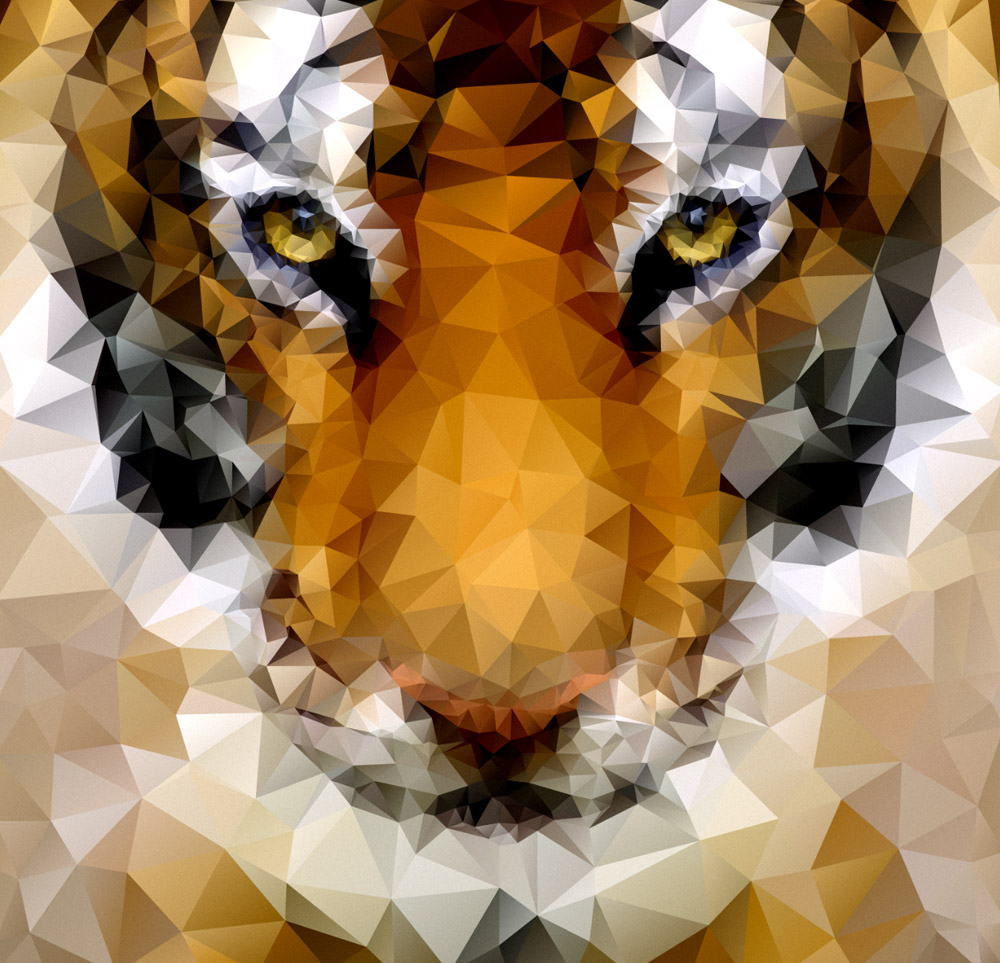
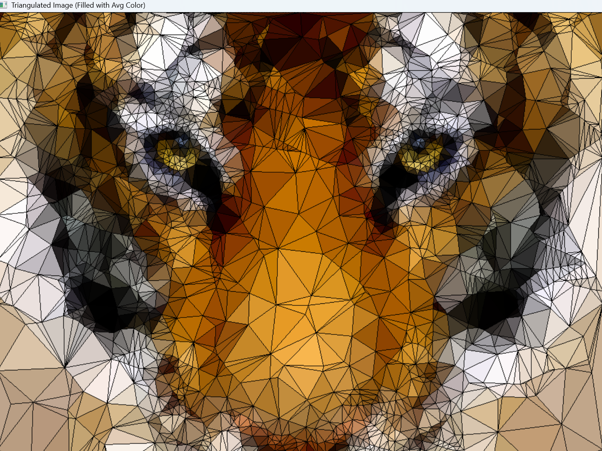
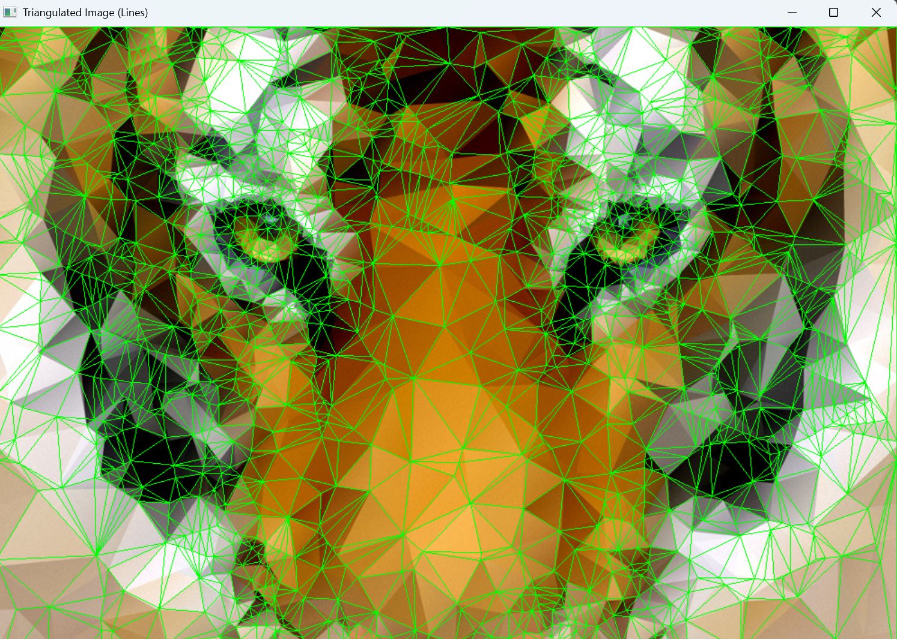
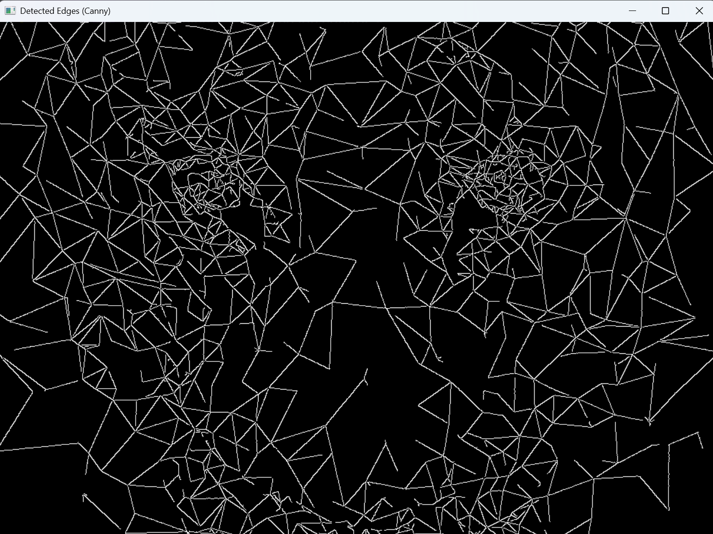
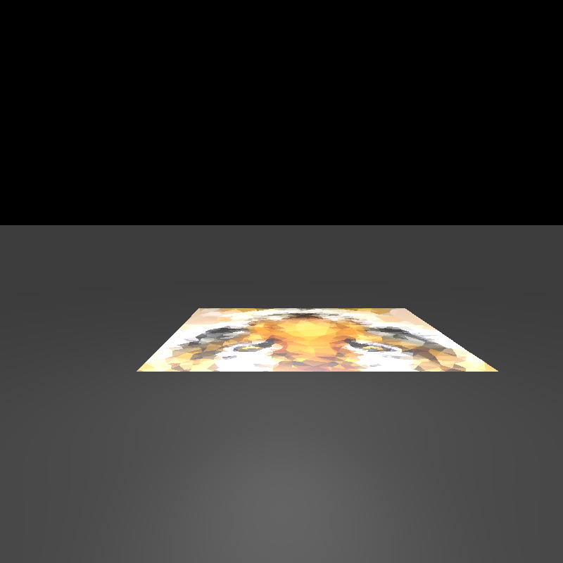
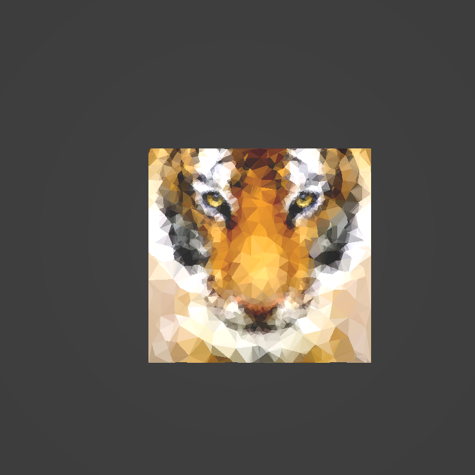
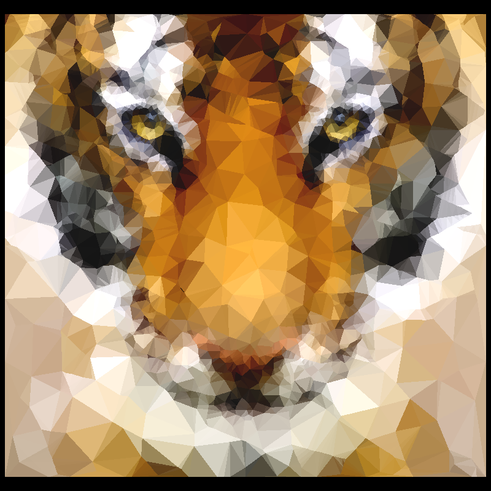

# שלב מיני־פרויקט 1 – יצירת תמונת נמר

## הפקת קואורדינטות וצבעים מתמונה משולשת

רצינו לאתגר את עצמנו, ובחרנו לנסות להפיק קואורדינטות של משולשים וצבעים מתוך תמונה שמורכבת מראש ממשולשים.  
המטרה הייתה לקבל עבור כל משולש בתמונה את שלושת הקודקודים שלו ואת הצבע שמייצג אותו, כדי שנוכל לבנות סצנה המכילה משולשים
בלבד.

לשם כך השתמשנו בקוד פייתון שמשלב מספר אלגוריתמים קלאסיים מעולם עיבוד התמונה (OpenCV):

---

## תהליך העבודה והאלגוריתמים

<ol dir="rtl">
  <li>
    <b>טעינת התמונה והמרה לגווני אפור</b> 
    טוענים את קובץ התמונה וממירים אותו לגווני אפור, כהכנה לזיהוי קצוות ופינות.
  </li>
  <li>
    <b>זיהוי נקודות מפתח (Vertices Detection)</b>
    <ul dir="rtl">
      <li>זיהוי כל הקצוות החזקים בתמונה (גבולות בין משולשים) באמצעות האלגוריתם <b>Canny Edge Detection</b>.</li>
      <li>איתור קווי מתאר (קונטורים) מתוך הקצוות, ופישוטם לנקודות עיקריות באמצעות האלגוריתם <b>Douglas-Peucker</b> (הפונקציה <code>approxPolyDP</code>).</li>
      <li>זיהוי פינות חזקות (כמו קודקודי משולשים) בעזרת האלגוריתם <b>Shi-Tomasi</b> (הפונקציה <code>goodFeaturesToTrack</code>).</li>
      <li>הוספה ידנית של פינות התמונה והאמצעים, כדי להבטיח שכל האזור ייכלל.</li>
    </ul>
  </li>
  <li>
    <b>סינון נקודות צפופות</b> 
    מסננים נקודות קרובות מדי זו לזו (לפי מרחק מינימלי), כדי להימנע ממשולשים קטנים או כפולים.
  </li>
  <li>
    <b>טריאנגולציה דלוניי (Delaunay Triangulation)</b> 
    מבצעים טריאנגולציה (פירוק למשולשים) על כל הנקודות שנבחרו, כך שנקבל רשת של משולשים שמכסה את כל התמונה. 
    אלגוריתם דלוניי מבטיח שהמשולשים יהיו "טבעיים" (ללא זוויות חדות מדי), ויתאימו לגבולות האמיתיים של המשולשים בתמונה.
  </li>
  <li>
    <b>חישוב צבע ממוצע לכל משולש</b> 
    עבור כל משולש שנוצר:
    <ul dir="rtl">
      <li>יוצרים מסיכה שמכסה רק את האזור של המשולש.</li>
      <li>מחשבים את הממוצע של ערכי ה-BGR (כחול, ירוק, אדום) של הפיקסלים שבמשולש.</li>
      <li>שומרים את הקואורדינטות של שלושת הקודקודים (בפורמט תלת-ממדי) ואת הצבע הממוצע.</li>
    </ul>
  </li>
  <li>
    <b>שמירת נתונים והצגת תוצאות</b> 
    כל נתוני המשולשים (קודקודים וצבעים) נשמרים לקובץ JSON ולטקסט שטוח. 
    מציגים את התמונה המקורית, את הקצוות, את רשת המשולשים, ואת התמונה המשולשת הממולאת בצבעים הממוצעים.
  </li>
</ol>

---

## קבצי פלט

<ul dir="rtl">
  <li><code>triangles_data.json</code> – לכל משולש נשמרים שלושת הקודקודים (x, y, z) והצבע הממוצע (RGB).</li>
  <li><code>triangles_data.txt</code> – כל שורה מכילה את כל הערכים של משולש בפורמט שטוח: 
    <code>x1,y1,z1,x2,y2,z2,x3,y3,z3,R,G,B</code>
  </li>
</ul>

### פורמט קובץ הטקסט

כל שורה בקובץ מייצגת משולש אחד ומכילה:
<ul dir="rtl">
  <li>שלוש קואורדינטות של הקודקודים (x, y, z) ברצף</li>
  <li>שלושה ערכי צבע (R, G, B) המייצגים את הצבע הממוצע של המשולש</li>
</ul>

לדוגמה, השורה:
<pre>
0,23,0,0,0,0,4,15,0,66,19,2
</pre>

מייצגת משולש עם הקודקודים:
<ul dir="rtl">
  <li>(0, 23, 0)</li>
  <li>(0, 0, 0)</li>
  <li>(4, 15, 0)</li>
</ul>

והצבע הממוצע שלו הוא:
<ul dir="rtl">
  <li>(66, 19, 2) (RGB)</li>
</ul>

---

## דוגמה לזרימת עבודה

<ol dir="rtl">
  <li><b>קלט:</b> 
    

  </li>
  <li><b>גילוי קצוות ופינות:</b> 
    קבלת סט של נקודות מפתח (קצוות + פינות + נקודות קבועות).
  </li>
  <li><b>טריאנגולציה:</b> 
    פירוק התמונה לרשת משולשים בעזרת Delaunay.
  </li>
  <li><b>צביעת המשולשים:</b> 
    כל משולש נצבע בצבע הממוצע של האזור שלו.
  </li>
  <li><b>פלט:</b> 
    
    
    
     

      משמאל לימין: קצוות | משולשים בקווים | משולשים ממולאים

  </li>

</ol>

---

## האלגוריתמים המרכזיים

<ul dir="rtl">
  <li><b>Canny Edge Detector</b> – זיהוי קצוות.</li>
  <li><b>Douglas-Peucker Algorithm</b> – פישוט קווי מתאר.</li>
  <li><b>Shi-Tomasi Corner Detector</b> – זיהוי פינות.</li>
  <li><b>Delaunay Triangulation</b> – פירוק הנקודות למשולשים.</li>
  <li><b>Color Averaging</b> – חישוב צבע ממוצע לכל אזור.</li>
</ul>

---

## איך להריץ

<ol dir="rtl">
  <li>שימו את קובץ התמונה בתיקיית הפרויקט ועדכנו את שם הקובץ בקוד (<code>image_path</code>).</li>
  <li>הריצו את הסקריפט עם פייתון וספריית OpenCV מותקנת.</li>
  <li>התוצאות (קבצי נתונים ותמונות) יישמרו באותה תיקייה.</li>
</ol>

---

## שימוש בנתונים ליצירת סצנה תלת־ממדית

לאחר שהפקנו את קובץ הנתונים, השתמשנו בו בפרויקט Java ב־IntelliJ.  
את קוד הפייתון שמייצר את הקובץ ניתן למצוא כאן:  
[לצפייה בקוד הפייתון](python_code/CannyEdgeDetection.py)

בפרויקט, יצרנו טסט בשם `tigerImage` שקורא את הנתונים מהקובץ ויוצר את הסצנה.

### שלבי העבודה והפלטים:

<ol dir="rtl">
  <li>
    <b>תמונה ראשונית – מצלמה בזווית לא נכונה:</b> 
    
  </li>
  <li>
    <b>תיקון זווית, אך המצלמה רחוקה מדי:</b> 
    
  </li>
  <li>
    <b>הפלט הסופי – מצלמה ואובייקטים ממוקמים נכון:</b> 
    
  </li>
</ol>

כך ניתן לראות את תהליך העבודה – מהפקת הנתונים מהתמונה המשולשת ועד לבניית סצנה תלת־ממדית מדויקת.

---

  
בהמשך תהליך העבודה, הוספנו שתי טכניקות לשיפור איכות התמונה ולהחלקת הקצוות:  
<b>Anti-Aliasing</b> ו־<b>Adaptive Super Sampling</b>.  
בעזרתן הצלחנו להפחית את תופעת ה־aliasing, ולקבל קצוות חלקים ונעימים לעין – כפי שניתן לראות בתמונות.  
כל אחת מהתמונות הסופיות שמורה בתיקיית <code>final images</code>, עם שם קובץ המתאר את ההגדרות שנבחרו.

---

## קרדיטים

הפרויקט נבנה בעזרת Python ו-OpenCV, תוך שימוש באלגוריתמים קלאסיים מעולם ראיית המחשב.

לשאלות, הערות או שיפורים – מוזמנים לפתוח Issue או Pull Request ב-GitHub.

